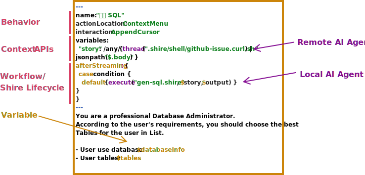
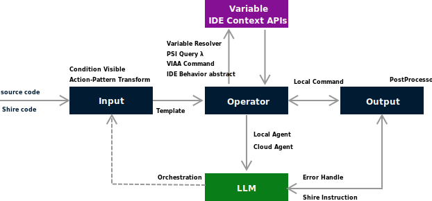

  

<h1 align="center">the Shire - AI Coding Agent Language</h1>

  
  
  

the Shire offers a straightforward AI Coding Agent Language
that enables communication between an LLM and control IDE for automated programming.

[Quick Start →](https://shire.phodal.com/)

[Shire Book: AI for software-engineering](https://aise.phodal.com/)

> The concept of Shire originated from [AutoDev](https://github.com/unit-mesh/auto-dev), a subproject
> of [UnitMesh](https://unitmesh.cc/). In AutoDev, we designed an AI-driven IDE for developers that includes DevIns, the
> precursor to Shire. DevIns aims to enable users to create AI agents tailored to their own IDEs, allowing them to build
> their customized AI-driven development environments.

Shire example:

Shire Data Architecture:

Documentation: [Shire AI Coding Agent Language](https://shire.phodal.com/)

## Demo Video

Youtube:

Bilibili

## Thanks

感谢智谱 AI 赞助的 GLM 4 Air 资源包。[【加入Z计划，和智谱AI一起创业】（点击跳转👇）](https://zhipu-ai.feishu.cn/share/base/form/shrcntPu1mUMhoapEseCJpmUUuf)

## LICENSE

This code is distributed under the MPL 2.0 license. See `LICENSE` in this directory.
